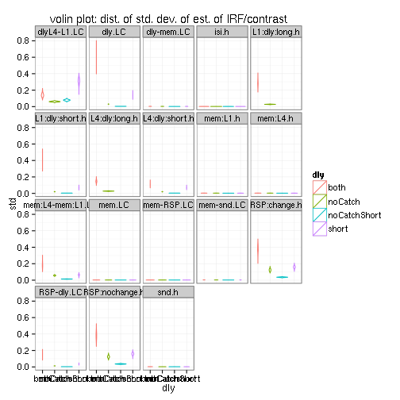

# WM Timing
There are 36 trials to schedule in 360 seconds. Trials types (high/low load + same/different) occur equally. 1/3 are catch. 
1000 random schedules are created with exponentially sampled ITI and ISI with and without (1000 ea) variable delay, see `mk1dWM.pl` and `mk1dWM_vardly.pl`. The `1D` description of the schedule is fed to `3dDecovolve -nodata` and the `norm. std. dev.` extracted for contrasts of interest. See page 83 of [3dDeconvolve manual](http://afni.nimh.nih.gov/pub/dist/doc/manual/3dDeconvolve.pdf): lower std is more power, **want small values**.


## Ranges

```
##       dly std.mem:L1 std.isi std.dly:short std.RSP:nochange std.RSP:change
## 1    both     1.7296  2.3571        0.2728           0.2203         0.2262
## 2    both     3.4516  6.6791        0.3803           0.2872         0.3058
## 3 noCatch     1.8417  2.3974        0.6213           0.2963         0.2969
## 4 noCatch     4.7764  8.2015        0.7298           0.3680         0.3644
## 5   short     1.9808  2.5248        0.3108           0.3041         0.3051
## 6   short     5.0803 10.3793        0.4032           0.3816         0.3767
##   std.mem:L4 std.snd std.mem std.mem:L4-mem:L1 std.dly std.mem-snd
## 1     1.7190  0.6258  3.4437            0.1687  0.4942      1.9430
## 2     3.4459  3.9428  6.8947            0.2176  0.6855      5.2482
## 3     1.8333  0.8850  3.6690            0.2008  1.1486      2.7297
## 4     4.7834  4.6088  9.5576            0.2278  1.3413      7.0101
## 5     1.9629  0.6731  3.9344            0.2273  0.3108      2.0610
## 6     5.0852  5.9056 10.1622            0.2958  0.4032      7.3597
##   std.mem-RSP std.dly:long
## 1      3.5036       0.2549
## 2      6.9152       0.3474
## 3      3.5977       0.5399
## 4      9.5093       0.6341
## 5      3.9950           NA
## 6     10.2845           NA
```

 


## Best
looking at event schedule with best mem-probe separation


```
##       dly memVRSP bestMvR_mean
## 1    both  3.5036     1.616938
## 2 noCatch  3.5977     1.828962
## 3   short  3.9950     1.954992
```
