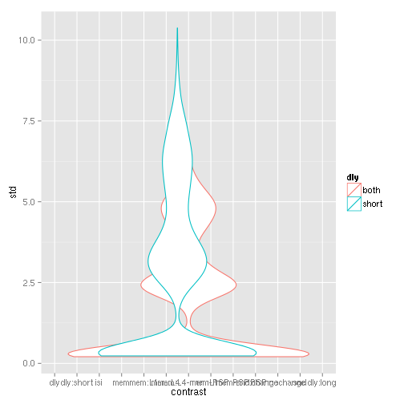

# Timing
page 83 of [3dDeconvolve manual](http://afni.nimh.nih.gov/pub/dist/doc/manual/3dDeconvolve.pdf): lower std is more power, want small values!

## WM

```r
# render file with
#knit('timingInfo.Rmd')
# prepare data
library(plyr)
library(ggplot2)
sofile<-Sys.glob('workingMemory_shortDelay/stims/*/eff.txt')
slfile<-Sys.glob('workingMemory_vardly/stims/*/eff.txt')
so <- adply(sofile,1,function(x){read.table(header=F,x,sep="\t")[,c(1,2,4)]})[2:4]
sl <- adply(slfile,1,function(x){read.table(header=F,x,sep="\t")[,c(1,2,4)]})[2:4]
so$dly <- "short"
sl$dly <- "both"
stds <- rbind(so,sl);
names(stds)<-c('n','contrast','std','dly')
wide<-reshape(stds,direction="wide",idvar=c("n","dly"),timevar="contrast")
```

### Ranges

```r
stdranges<-ddply(wide, .(dly), function(d){
  sapply(grep('std.',names(wide)),function(x){range(d[,x])})
} )
names(stdranges)[2:length(names(stdranges))]<-names(wide)[grep('std.',names(wide))]
print(stdranges)
```

```
##     dly std.mem:L1 std.isi std.dly:short std.RSP:nochange std.RSP:change
## 1  both     1.7296  2.3571        0.2728           0.2203         0.2262
## 2  both     3.4516  6.6791        0.3803           0.2872         0.3058
## 3 short     1.9808  2.5248        0.3108           0.3041         0.3051
## 4 short     5.0803 10.3793        0.4032           0.3816         0.3767
##   std.mem:L4 std.snd std.mem std.mem:L4-mem:L1 std.dly std.mem-snd
## 1     1.7190  0.6258  3.4437            0.1687  0.4942      1.9430
## 2     3.4459  3.9428  6.8947            0.2176  0.6855      5.2482
## 3     1.9629  0.6731  3.9344            0.2273  0.3108      2.0610
## 4     5.0852  5.9056 10.1622            0.2958  0.4032      7.3597
##   std.mem-RSP std.dly:long
## 1      3.5036       0.2549
## 2      6.9152       0.3474
## 3      3.9950           NA
## 4     10.2845           NA
```

```r
p<-ggplot(stds,aes(x=contrast,y=std,color=dly,group=dly)) + geom_violin()
print(p)
```

```
## Warning: position_dodge requires constant width: output may be incorrect
```

```
## Warning: position_dodge requires non-overlapping x intervals
```

 


### Best
looking at event schedule with best mem-probe separation


```r
bestTable<-ddply(wide, .(dly), function(x){
  i<-which.min(x[,'std.mem-RSP']);
  data.frame(
     memVRSP=x[i,'std.mem-RSP'],
     bestMvR_mean=mean(unlist(x[i,grep('std.',names(x))]),na.rm=T ) 
  )
} )
print(bestTable)
```

```
##     dly memVRSP bestMvR_mean
## 1  both  3.5036     1.616938
## 2 short  3.9950     1.954992
```
