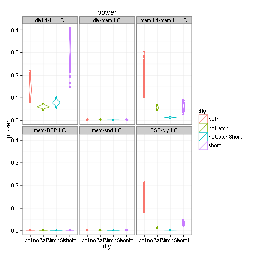

# WM Timing
There are `n` trials to schedule in 360 seconds. Trials types (high/low load + same/different) occur equally. If catch trials are used, 1/3 of all are catch (1/2 before dly, 1/2 after dly). If varable delay is used on noCatch and "both". Delays are `1s` and `3s`, distributed evenly.

1. snd (cue )
1. isi
1. mem (load1 or load4)
1. [possible catch]
1. dly (short (1s) or long (3s) )
1. [possible catch]
1. RSP (response, aka probe: change and nochange)

1000 random schedules are created with exponentially sampled ITI and ISI with and without (1000 ea) variable delay, see `mk1dWM.pl` and `mk1dWM_vardly.pl`. The `1D` description of the schedule is fed to `3dDecovolve -nodata` and the `norm. std. dev.` extracted for contrasts of interest. See page 83 of [3dDeconvolve manual](http://afni.nimh.nih.gov/pub/dist/doc/manual/3dDeconvolve.pdf): lower std is more power, **want small values**.

|          |both|noCatch|short|noCatchShort|
|----      |----|-------|-----|------------|
|ITI       |2.5 | 2     |7.5  |2.5         |
|fullTrials| 36 |48     |36   |48          |
|trials    | 48 |48     |48   |48          |


```r
# Power = Pr(Z>x)  where Z ~ N(0,1)
k=3   # alpha=.0013
s=15  # mesure error std dev
AB=10 # a>b by 10 IRF of A 10 units greater than B
erf <- function(x) 2 * pnorm(x * sqrt(2)) - 1
prz <- function(x) 1-1/2*(1+erf(x/sqrt(2)))
# page 87 afni 3dDeconvolve man
afniprz <- function(x) prz(k-AB/(s*x) )
```


## Ranges

```
##            dly std.mem:L1.h std.isi.h std.dly:short.h std.RSP:nochange.h
## 1         both       1.7296    2.3571          0.2728             0.2203
## 2         both       3.4516    6.6791          0.3803             0.2872
## 3      noCatch       1.6960    2.6367          0.6041             0.3232
## 4      noCatch       3.5032    7.1479          0.6933             0.4088
## 5 noCatchShort       2.7148    2.9761          1.9997             0.5045
## 6 noCatchShort       5.1821    7.3294          2.7480             0.6242
## 7        short       1.9808    2.5248          0.3108             0.3041
## 8        short       5.0803   10.3793          0.4032             0.3816
##   std.RSP:change.h std.mem:L4.h std.snd.h std.mem.LC std.mem:L4-mem:L1.LC
## 1           0.2262       1.7190    0.6258     3.4437               0.1687
## 2           0.3058       3.4459    3.9428     6.8947               0.2176
## 3           0.3265       1.6958    0.9413     3.3863               0.1825
## 4           0.4043       3.5037    4.3469     7.0040               0.2095
## 5           0.5131       2.7174    1.8701     5.4288               0.1770
## 6           0.6337       5.1919    4.3244    10.3721               0.2088
## 7           0.3051       1.9629    0.6731     3.9344               0.2273
## 8           0.3767       5.0852    5.9056    10.1622               0.2958
##   std.dly.LC std.mem-snd.LC std.mem-RSP.LC std.dly:long.h
## 1     0.4942         1.9430         3.5036         0.2549
## 2     0.6855         5.2482         6.9152         0.3474
## 3     1.1279         2.8240         3.4317         0.5396
## 4     1.2632         5.6598         6.9678         0.6107
## 5     1.9997         6.4474         4.9389             NA
## 6     2.7480         9.3799         9.8744             NA
## 7     0.3108         2.0610         3.9950             NA
## 8     0.4032         7.3597        10.2845             NA
```

  


## Best
looking at event schedule with best mem-probe separation


```
## Error in eval(expr, envir, enclos): undefined columns selected
```

```
##     dly memVRSP bestMvR_mean
## 1  both  3.5036     1.616938
## 2 short  3.9950     1.954992
```
